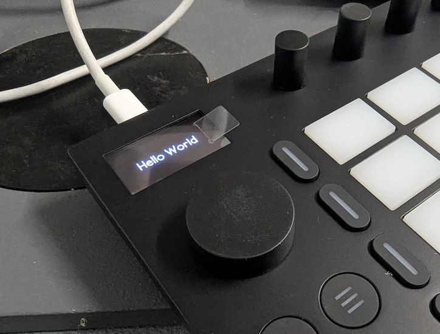

# Ableton Move

## SSH Access ...

        Set up WIFI on the device
        Add your SSH public key to http://move.local/development/ssh
        Accept the key on the device.
        SSH to ableton@move or root@move

## I2S ...

        Not used?

## I2C ...

        root@move:~# i2cdetect 1

        WARNING! This program can confuse your I2C bus, cause data loss and worse!
        I will probe file /dev/i2c-1.
        I will probe address range 0x08-0x77.
        Continue? [Y/n] y

            0  1  2  3  4  5  6  7  8  9  a  b  c  d  e  f
        00:                         -- -- -- -- -- -- -- --
        10: -- -- -- -- -- -- -- -- -- -- -- -- -- -- -- --
        20: -- -- -- -- -- -- -- -- -- -- -- -- -- -- -- --
        30: -- -- -- -- -- -- -- -- -- -- -- -- -- -- -- --
        40: -- -- -- -- -- -- -- -- -- -- -- -- -- -- -- --
        50: -- -- -- -- -- -- -- -- -- -- -- -- -- -- -- --
        60: -- -- -- -- -- -- -- -- -- -- -- -- -- -- -- --
        70: -- -- -- -- -- -- -- --

        root@move:~# i2cdetect 22

        WARNING! This program can confuse your I2C bus, cause data loss and worse!
        I will probe file /dev/i2c-22.
        I will probe address range 0x08-0x77.
        Continue? [Y/n] y

            0  1  2  3  4  5  6  7  8  9  a  b  c  d  e  f
        00:                         -- -- -- -- -- -- -- --
        10: -- -- -- -- -- -- -- -- -- -- -- -- -- -- -- --
        20: -- -- -- -- -- -- -- -- -- -- -- -- -- -- -- --
        30: -- -- -- -- -- -- -- -- -- -- -- -- -- -- -- --
        40: -- -- -- -- -- -- -- -- -- -- -- -- -- -- -- --
        50: -- UU -- -- -- -- -- -- -- -- -- -- -- -- -- --
        60: -- -- -- -- -- -- -- -- -- -- -- -- -- -- -- --
        70: -- -- -- -- -- -- -- --

## lspci

        root@move:~/hack# lspci

        01:00.0 Class 0280: 8086:2526
        00:00.0 Class 0604: 14e4:2711

## lsmod

        root@move:~/# lsmod

        Module                  Size  Used by
        usb_f_ncm              28672  2
        u_ether                28672  1 usb_f_ncm
        ctr                    16384  3
        aes_generic            36864  6
        libaes                 16384  1 aes_generic
        ccm                    20480  9
        ipv6                  540672  33
        usb_f_fs               45056  0
        libcomposite           69632  11 usb_f_fs,usb_f_ncm
        i2c_dev                20480  0
        i2c_bcm2708            16384  0
        ablspi                 24576  1
        iwlmvm                385024  0
        mac80211              913408  1 iwlmvm
        libarc4                16384  1 mac80211
        iwlwifi               389120  1 iwlmvm
        cfg80211              880640  3 iwlmvm,iwlwifi,mac80211
        rfkill                 32768  3 cfg80211
        dwc2                  192512  0
        roles                  20480  1 dwc2
        i2c_bcm2835            16384  0
        spi_bcm2835            24576  0
        raspberrypi_hwmon      16384  0
        uio_pdrv_genirq        16384  0
        uio                    24576  1 uio_pdrv_genirq
        nvmem_rmem             16384  0
